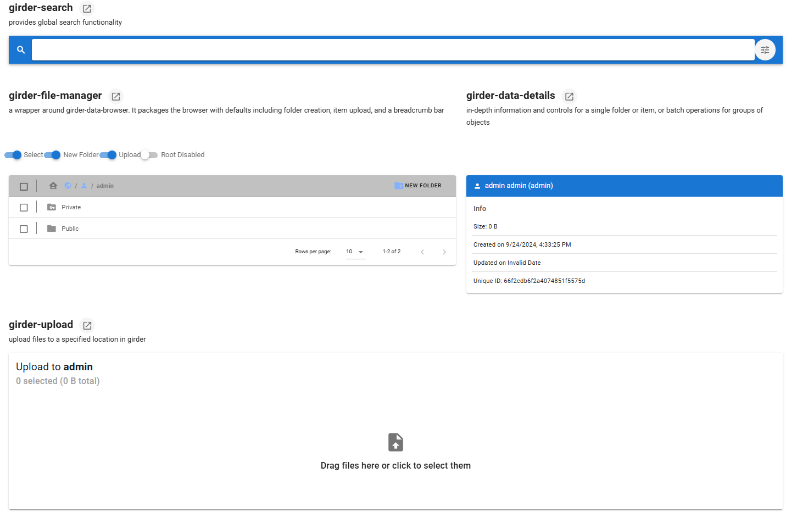

Girder Web Components for trame
==================================

trame-gwc extend trame **widgets** with components that can be used to authenticate to girder and to manage files, jobs and accesses.
It leverages `girder_web_components <https://github.com/girder/girder_web_components>`_.

|screenshot|

Installing
-----------------------------------------------------------

trame-gwc can be installed with `pip <https://pypi.org/project/trame-gwc/>`_:

.. code-block:: bash

    pip install --upgrade trame-gwc

Usage
-----------------------------------------------------------

The `Trame Tutorial <https://kitware.github.io/trame/guide/tutorial>`_ is the place to go to learn how to use the library and start building your own application.

The `API Reference <https://trame.readthedocs.io/en/latest/index.html>`_ documentation provides API-level documentation.

License
-----------------------------------------------------------

trame-gwc is made available under the Apache License.
For more details, see `LICENSE <https://github.com/Kitware/trame-gwc/blob/main/LICENSE>`_. This license has been chosen to match the one use by `girder_web_components <https://github.com/girder/girder_web_components>` which can be exposed via this library.

Community
-----------------------------------------------------------

`Trame <https://kitware.github.io/trame/>`_ | `Discussions <https://github.com/Kitware/trame/discussions>`_ | `Issues <https://github.com/Kitware/trame/issues>`_ | `Contact Us <https://www.kitware.com/contact-us/>`_

.. image:: https://zenodo.org/badge/410108340.svg
    :target: https://zenodo.org/badge/latestdoi/410108340

Enjoying trame?
-----------------------------------------------------------

Share your experience `with a testimonial <https://github.com/Kitware/trame/issues/18>`_ or `with a brand approval <https://github.com/Kitware/trame/issues/19>`_.

Development
-----------------------------------------------------------

Build and install the Vue components (see `vue-components/README.md <https://github.com/Kitware/trame-gwc/blob/main/vue-components/README.md>`_)

.. code-block:: console

    cd vue-components
    pnpm i
    pnpm run build
    cd ..

Install the application for development

.. code-block:: console

    pip install -e .

Examples
-----------------------------------------------------------

This repository includes several example applications demonstrating how to
use Girder Web Components with trame.

The examples use `data.kitware.com <https://data.kitware.com/>`_ as the
default Girder instance.

Available examples
^^^^^^^^^^^^^^^^^^^^^^^^^^^^^^^^^^^^^^^^^^^^^^^^^^^^^^^^^^^

**Showcase demo**

The ``showcase/app.py`` application is a lightweight demonstration of the
available Girder Web Components and their integration with trame.
It is inspired by the official
`Girder Web Components demo app <https://gwc.girder.org/>`_.

**File Browser example**

The ``file_browser/app.py`` application shows how to build a more
structured trame application around Girder. It demonstrates how to:

- browse the Girder database
- parse collections and folders
- manage authentication
- download files (using the girder client)

Run the examples
^^^^^^^^^^^^^^^^^^^^^^^^^^^^^^^^^^^^^^^^^^^^^^^^^^^^^^^^^^^

.. code-block:: console

    pip install ".[examples]"

    # Run the basic demo
    python examples/showcase/app.py

    # Run the advanced example
    python examples/file_browser/app.py

JavaScript dependency
-----------------------------------------------------------

This Python package bundle the ``@girder/components@3.2.0`` JavaScript library. If you would like us to upgrade it, `please reach out <https://www.kitware.com/trame/>`_.
